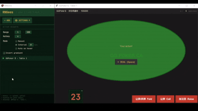

# RNGees v1.1.2

A lightweight RNG overlay for online poker. RNGees sits on top of your poker table and generates a random number on demand — helping you implement mixed GTO strategies without bias.

---

## Features

- **Auto-attaches** to poker table windows by title keyword
- **Three roll modes** — mutually exclusive:
  - **Manual** — click the widget to roll
  - **Interval** — auto-roll every N seconds
  - **Auto on hover** — rolls when your cursor enters the table window, clears when it leaves
- **Customizable range** — default 1–100, set any range
- **Gradient coloring** — number color reflects its position in the range (red → gold → green), invertible
- **Resizable widget** — drag edges/corners to resize, drag center to reposition
- **Always on top** — overlay stays above the poker client
- **Multiple tables** — one widget per detected table, plus manual widgets
- **Focus indicator** — active table row highlights gold in the control panel

---

## Download

Grab the latest \`RNGees.exe\` from [Releases](/Releases) — no Python required.

---

## Run from Source

**Requirements**
\`\`\`
pip install -r requirements.txt
\`\`\`

> \`pywin32\` — window detection and positioning
> \`Pillow\` — icon rendering
> \`keyboard\` — global hotkey (works even when poker client is focused)

**Launch**
\`\`\`
python RNGees.py
\`\`\`

RNGees will automatically detect any open poker table window and attach a widget to it. Open the **⚙ SETTINGS** drawer to configure range, mode, hotkey, and gradient.

---

## Build Executable

\`\`\`
build.bat
\`\`\`

Output: \`dist\RNGees.exe\` — this is the only file you need to share or run.

\`\`\`
RNGees
├── dist
│   └── RNGees.exe          ← executable
├── build\                  ← safe to delete
├── RNGees.spec             ← safe to delete
├── rngees_config.json      ← settings, auto-created on first run
└── ...
\`\`\`

> **Note:** Some antivirus software may flag PyInstaller executables as suspicious. This is a known false positive. Build from source if preferred.

---

## Auto on Hover — Hover Detection

When **Auto on hover** mode is enabled, RNGees uses **cursor hover detection** to determine when it's your turn to act:

- When your cursor moves **from outside to inside** a GGPoker table window, a new number is rolled automatically
- When your cursor **leaves** the table window, the number display is cleared
- Detection is purely geometric — \`GetCursorPos\` is compared against the table window bounds each tick
- No screen capture, no foreground window polling, no click heuristics

**Why this works for GGPoker:** When it's your action, you move your cursor to the table to click or smart focus. That cursor entry is the trigger — no screenshot or process interaction required, so GGPoker's anti-bot measures have nothing to block.

**Zero additional CPU cost** — cursor position is a single Win32 call already made each tick for widget repositioning.

---

## Testing

\`MockTable.py\` simulates a poker table for testing without a real poker client:

\`\`\`
python MockTable.py
\`\`\`

Press **Space** to trigger an action, then move your cursor into the MockTable window to test hover detection.

---

## Changelog

### v1.1.2
- Timer thread: _loop2 called generate() directly off the main thread — fixed with after(0, self.generate)
- Scan loop: _scan_loop created/destroyed widgets and modified shared state from a background thread — moved all tkinter ops to a new _apply_scan method on the main thread
- Redundant moves: _track_loop posted geometry() to the main thread 5×/sec even when the table hadn't moved — added position cache to only dispatch on actual changes

### v1.1.1
- Fixed few bugs (hover mode independency, dot green logic)

### v1.1.0
- **Auto on action reworked** — replaced screen capture with hover detection via \`GetCursorPos\` + window bounds check. Rolls on cursor enter, clears on cursor leave. Immune to anti-bot screenshot blocking
- **Focus indicator** — active table row dot turns gold in the control panel
- - ~~**Animation of Rolling**~~ — removed for better performance of the app -> faster response, less system resources allocated
- Removed \`dxcam\`, \`numpy\`, \`mss\` dependencies — no longer needed
- Removed all screen capture code — Pillow only used for icon rendering

### v1.0.0
- Initial release
- Screen capture based action detection (PIL ImageGrab)
- Auto-attach to poker tables by title keyword
- Manual, interval, and auto-on-action modes

---

## Notes

- Overlay is display-only and does not interact with the game client in any way
- Tested on GGPoker.ca
