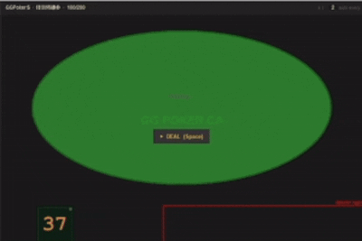

# RNGees

A lightweight RNG overlay for online poker. RNGees sits on top of your poker table and generates a random number on demand — helping you implement mixed GTO strategies without bias.



---

## Features

- **Auto-attaches** to poker table windows by title keyword 
- **Three roll modes** — mutually exclusive:
  - **Manual** — roll on hotkey press
  - **Interval** — auto-roll every N seconds
  - **Auto on action** — detects when action buttons appear on screen and rolls automatically
- **Customizable range** — default 1–100, set any range
- **Gradient coloring** — number color reflects its position in the range (red → gold → green), invertible
- **Resizable widget** — drag edges/corners to resize, drag center to reposition
- **Always on top** — overlay stays above the poker client
- **Multiple tables** — one widget per detected table, plus manual widgets

---

## Download

Grab the latest `RNGees.exe` from [Releases](/Releases) — no Python required.

---

## Run from Source

**Requirements**
```
pip install -r requirements.txt
```

> `pywin32` — window detection and positioning  
> `Pillow` — screen capture for action detection  
> `keyboard` — global hotkey (works even when poker client is focused)

**Launch**
```
run.bat
```
or
```
python RNGees.py
```

RNGees will automatically detect any open poker table window and attach a widget to it. Open the **Settings** drawer to configure range, mode, hotkey, and gradient.

---

## Build Executable

To build a standalone `source\RNGees.exe`:

```
build.bat
```

Output: `dist\RNGees.exe` — this is the only file you need to share or run. The `build\` folder and `RNGees.spec` are build artifacts and can be ignored or deleted.

```
RNGees├── dist│   └── RNGees.exe      ← this is the executable
├── build\              ← safe to delete
├── RNGees.spec         ← safe to delete
├── rngees_config.json  ← settings, auto-created on first run
└── ...
```

> **Note:** Some antivirus software may flag PyInstaller executables as suspicious. This is a known false positive. Build from source if preferred.

---

## Action Detection (DEVELOPING)

~~When **Auto on action** mode is enabled, RNGees monitors a region at the bottom-right of the table window using screen pixel sampling. When the action buttons appear (Fold / Call / Raise), a new number is automatically rolled.~~

~~- Works by detecting brightness change in the button area — no game memory reading~~
~~- Inset from window borders to avoid false triggers from hover highlights~~
~~- Resets baseline on table resize~~
- **Known issue: Action detection table feature is not working fine (with potential anti-botting blocking screenshot feature with poker sites).**
- A new approach is under development.

---

## Testing

`source\MockTable.py` simulates a poker table for testing without a real poker client:

```
python MockTable.py
```


---

## Notes
- Known issue: Action detection table feature is not working fine (with potential anti-botting blocking screenshot feature with poker sites). 
- Overlay is display-only and does not interact with the game client in any way
- Tested on GGPoker.ca
